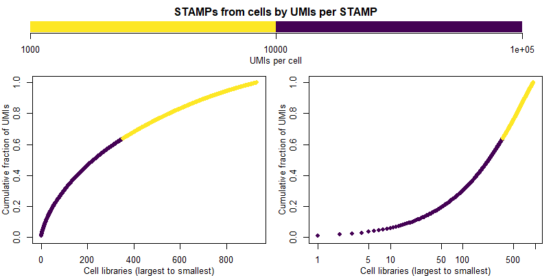
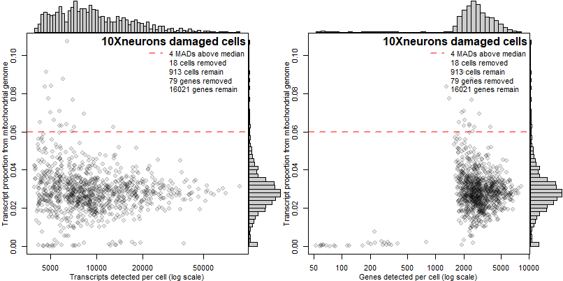
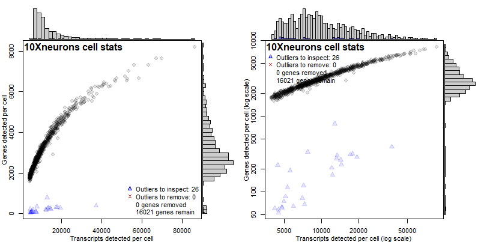
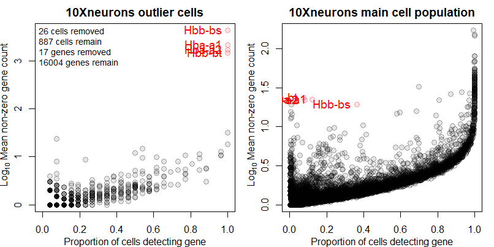
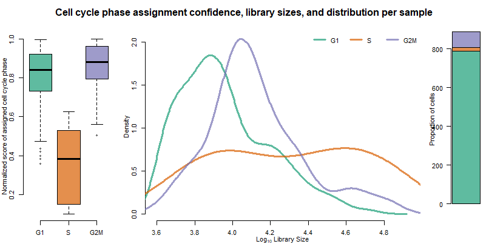
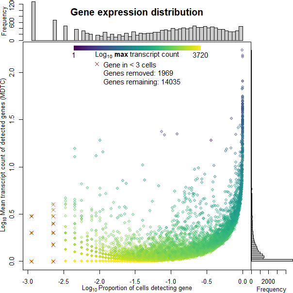
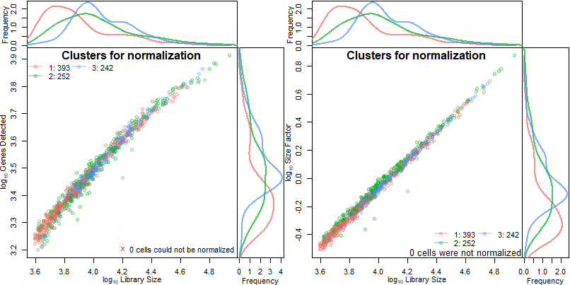
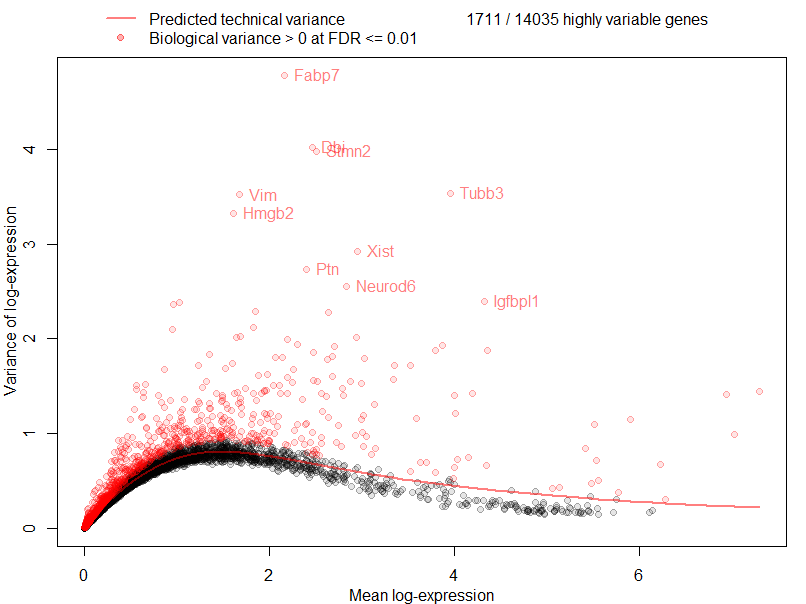

### [Home](/scClustViz)
-   [Quality control and
    normalization](#quality-control-and-normalization)
-   [Cell filtering](#cell-filtering)
    -   [Mitochondrial gene content](#mitochondrial-gene-content)
    -   [Outlier filtering](#outlier-filtering)
    -   [Outlier inspection](#outlier-inspection)
    -   [Cell cycle prediction using
        *Cyclone*](#cell-cycle-prediction-using-cyclone)
    -   [Filter out low abundance
        genes](#filter-out-low-abundance-genes)
-   [Normalization](#normalization)
-   [Highly variable genes](#highly-variable-genes)

Quality control and normalization
=================================

    input_dataPath <- "../scClustViz_files/neurons_900_filtered_gene_bc_matrices/filtered_gene_bc_matrices/mm10/" 
    ##  Path to 10X output directory (containing .mtx file)
    ##  i.e. http://cf.10xgenomics.com/samples/cell-exp/2.1.0/neurons_900/neurons_900_filtered_gene_bc_matrices.tar.gz
    dataPath <- "../scClustViz_files/demo_10Xneurons900/" 
    ##  Path to analysis output directory
    ##  Will be created if it doesn't already exist
    dataSpecies <- "mouse" 
    ##  Set species ("mouse"/"human" or add your own - see below)
    dataName <- "10Xneurons" 
    ##  Name your analysis results

    library(Matrix)
    library(scales)
    library(viridis)

    ## Loading required package: viridisLite

    ## 
    ## Attaching package: 'viridis'

    ## The following object is masked from 'package:scales':
    ## 
    ##     viridis_pal

    library(RColorBrewer)
    library(biomaRt)      # from Bioconductor
    library(scran)        # from Bioconductor

    ## Loading required package: BiocParallel

    ## Loading required package: SingleCellExperiment

    ## Loading required package: SummarizedExperiment

    ## Loading required package: GenomicRanges

    ## Loading required package: stats4

    ## Loading required package: BiocGenerics

    ## Loading required package: parallel

    ## 
    ## Attaching package: 'BiocGenerics'

    ## The following objects are masked from 'package:parallel':
    ## 
    ##     clusterApply, clusterApplyLB, clusterCall, clusterEvalQ,
    ##     clusterExport, clusterMap, parApply, parCapply, parLapply,
    ##     parLapplyLB, parRapply, parSapply, parSapplyLB

    ## The following objects are masked from 'package:Matrix':
    ## 
    ##     colMeans, colSums, rowMeans, rowSums, which

    ## The following objects are masked from 'package:stats':
    ## 
    ##     IQR, mad, sd, var, xtabs

    ## The following objects are masked from 'package:base':
    ## 
    ##     anyDuplicated, append, as.data.frame, basename, cbind,
    ##     colMeans, colnames, colSums, dirname, do.call, duplicated,
    ##     eval, evalq, Filter, Find, get, grep, grepl, intersect,
    ##     is.unsorted, lapply, lengths, Map, mapply, match, mget, order,
    ##     paste, pmax, pmax.int, pmin, pmin.int, Position, rank, rbind,
    ##     Reduce, rowMeans, rownames, rowSums, sapply, setdiff, sort,
    ##     table, tapply, union, unique, unsplit, which, which.max,
    ##     which.min

    ## Loading required package: S4Vectors

    ## 
    ## Attaching package: 'S4Vectors'

    ## The following object is masked from 'package:Matrix':
    ## 
    ##     expand

    ## The following object is masked from 'package:base':
    ## 
    ##     expand.grid

    ## Loading required package: IRanges

    ## 
    ## Attaching package: 'IRanges'

    ## The following object is masked from 'package:grDevices':
    ## 
    ##     windows

    ## Loading required package: GenomeInfoDb

    ## Loading required package: Biobase

    ## Welcome to Bioconductor
    ## 
    ##     Vignettes contain introductory material; view with
    ##     'browseVignettes()'. To cite Bioconductor, see
    ##     'citation("Biobase")', and for packages 'citation("pkgname")'.

    ## Loading required package: DelayedArray

    ## Loading required package: matrixStats

    ## 
    ## Attaching package: 'matrixStats'

    ## The following objects are masked from 'package:Biobase':
    ## 
    ##     anyMissing, rowMedians

    ## 
    ## Attaching package: 'DelayedArray'

    ## The following objects are masked from 'package:matrixStats':
    ## 
    ##     colMaxs, colMins, colRanges, rowMaxs, rowMins, rowRanges

    ## The following objects are masked from 'package:base':
    ## 
    ##     aperm, apply

    library(DropletUtils) # from Bioconductor

    if (Sys.info()["sysname"] == "Windows") { sys <- "D:/" } else { sys <- "~/" }
    if (dataSpecies == "mouse") {
      mart <- useMart("ensembl","mmusculus_gene_ensembl")
      speciesSymbol <- "mgi_symbol"
      speciesMito <- "^mt-"
      cycloneSpeciesMarkers <- "mouse_cycle_markers.rds"
    } else if (dataSpecies == "human") {
      mart <- useMart("ensembl","hsapiens_gene_ensembl")
      speciesSymbol <- "hgnc_symbol"
      speciesMito <- "^MT-"
      cycloneSpeciesMarkers <- "human_cycle_markers.rds"
    } else { print("Set species please!") }
    dir.create(dataPath,recursive=T,showWarnings=F)

    plotHistHoriz <- function(input,col="grey80",add=F) {
      tempH <- hist(input,breaks=50,plot=F)
      if (!add) {
        plot(x=NULL,y=NULL,xlim=range(tempH$counts),ylim=range(input),
             bty="n",ylab=NA,yaxt="n",xaxt="n",xlab=NA)
      }
      rect(xleft=rep(0,length(tempH$counts)),ybottom=tempH$breaks[-length(tempH$breaks)],
           xright=tempH$counts,ytop=tempH$breaks[-1],col=col)
    }

    rainbow2 <- function(n,a=1) {
      require(scales)
      hues = seq(15, 375, length = n + 1)
      alpha(hcl(h = hues, l = 60, c = 100)[1:n],a)
    }

Cell filtering
==============

    ebRaw <- counts(read10xCounts(input_dataPath,col.names=T))
    ebRaw <- ebRaw[,Matrix::colSums(ebRaw) > 0]
    ebRaw <- ebRaw[Matrix::rowSums(ebRaw) > 0,]

    ##  Check rownames at this point.  This workflow expects MGI or HGNC gene symbols as the 
    ##  rownames.  If the data was aligned to a reference genome that used ensembl gene IDs or
    ##  another annotation you will have to either convert them to gene symbols, or identify 
    ##  which ensembl IDs correspond to the mitochondrial genome for the mitoFilt step.

    geneRowNames <- "ensembl_gene_id" # Set if rownames are ensemble gene IDs
    #geneRowNames <- speciesSymbol   # Set if rownames are gene symbols (no conversion).

    ####

    if (geneRowNames != speciesSymbol) {
      e2g <- getBM(attributes=c(geneRowNames,speciesSymbol),
                   mart=mart,filters=geneRowNames,
                   values=rownames(ebRaw))
      if (nrow(e2g) < 10) { 
        stop("Check row names and select appropriate rowname identifier!") 
      }
      ##  Removing unmapped gene symbols from conversion table
      e2g <- e2g[e2g[,speciesSymbol] != "",] 
      print(paste(sum(duplicated(e2g[,geneRowNames])),
                  geneRowNames,"mapped to multiple",speciesSymbol))
      ##  Arbitrarily picking one mapping for the above duplicates, 
      ##  since these generally map to predicted genes anyway.
      e2g <- e2g[!duplicated(e2g[,geneRowNames]),] 
      rownames(e2g) <- e2g[,geneRowNames]
      ebRaw <- ebRaw[e2g[,geneRowNames],] # removing unmapped genes from data
      temp_repName <- unique(e2g[,speciesSymbol][duplicated(e2g[,speciesSymbol])])
      print(paste(length(temp_repName),speciesSymbol,"mapped to multiple",geneRowNames))
      ##  Going to collapse these by summing UMI counts between duplicated rows.
      temp_repRow <- ebRaw[e2g[,speciesSymbol] %in% temp_repName,]
      ebRaw <- ebRaw[!e2g[,speciesSymbol] %in% temp_repName,]
      ##  Removed duplicated rows from data, saved as separate object
      rownames(ebRaw) <- e2g[rownames(ebRaw),speciesSymbol] # renamed rows in data as symbols
      temp_repRow <- Matrix(t(sapply(temp_repName,function(X) 
        Matrix::colSums(temp_repRow[e2g[,geneRowNames][e2g[,speciesSymbol] == X],]))),sparse=T)
      ##  Collapsed by summing each duplicated gene symbol's row
      ebRaw <- rbind(ebRaw,temp_repRow)  # added those data back to matrix
    }

    ## [1] "0 ensembl_gene_id mapped to multiple mgi_symbol"
    ## [1] "12 mgi_symbol mapped to multiple ensembl_gene_id"

    ##  Consolidating duplicated gene names 
    ##  (if genes are in under their MGI and HGNC symbols, or some other annotation mixup)
    if (any(duplicated(toupper(rownames(ebRaw))))) {
      temp_repName <- unique(toupper(rownames(ebRaw)[duplicated(toupper(rownames(ebRaw)))]))
      print(paste(dataName,"-",length(temp_repName),"duplicated gene names."))
      ##  Going to collapse these by summing UMI counts between duplicated rows.
      temp_repRow <- ebRaw[toupper(rownames(ebRaw)) %in% temp_repName,]
      ebRaw <- ebRaw[!toupper(rownames(ebRaw)) %in% temp_repName,]
      if (!exists("e2g")) {
        e2g <- getBM(attributes=speciesSymbol,
                     mart=mart,filters=speciesSymbol,
                     values=rownames(temp_repRow))
      }
      rownames(e2g) <- toupper(e2g$mgi_symbol)
      if (any(!temp_repName %in% rownames(e2g))) { 
        warning(paste("Some of your duplicated rownames aren't",
                      speciesSymbol,"and are being removed."))
        temp_repName <- temp_repName[temp_repName %in% rownames(e2g)]
      }
      temp_repRow <- Matrix(t(sapply(temp_repName,function(X) 
        Matrix::colSums(temp_repRow[toupper(rownames(temp_repRow)) == X,]))),sparse=T)
      rownames(temp_repRow) <- e2g[rownames(temp_repRow),"mgi_symbol"]
      ebRaw <- rbind(ebRaw,temp_repRow)  # added those data back to matrix
      rm(temp_repName,temp_repRow)
    }
    rm(list=ls()[grepl("temp",ls())])

    libSize <- Matrix::colSums(ebRaw)
    cumCounts <- cumsum(libSize[order(libSize,decreasing=T)])
    maxCount <- 10^ceiling(log10(max(libSize)))
    countCols <- cut(log10(libSize[order(libSize,decreasing=T)]),
                     breaks=floor(log10(min(libSize))):ceiling(log10(max(libSize))),
                     labels=F,include.lowest=T)
    layout(matrix(c(3,3,1:2),nrow=2,byrow=T),heights=c(1,3.2))
    par(mar=c(3,3,1,1),mgp=2:0)
    plot(seq_along(cumCounts),cumCounts/max(cumCounts),pch=19,ylim=c(0,1),
         col=viridis(max(countCols),d=-1)[countCols],
         xlab="Cell libraries (largest to smallest)",ylab="Cumulative fraction of UMIs")
    plot(seq_along(cumCounts),cumCounts/max(cumCounts),pch=19,log="x",ylim=c(0,1),
         col=viridis(max(countCols),d=-1)[countCols],
         xlab="Cell libraries (largest to smallest)",ylab="Cumulative fraction of UMIs")
    par(mar=c(3,1,2,1))
    barplot(rep(1,max(countCols)),col=viridis(max(countCols),d=-1),
            space=0,border=NA,axes=F,xlab="UMIs per cell")
    axis(side=1,at=0:max(countCols),
         labels=sapply(floor(log10(min(libSize))):ceiling(log10(max(libSize))),
                       function(X) 10^X))
    title(main="STAMPs from cells by UMIs per STAMP")

This is to check the cell filtering done in CellRanger. If you have
cells with small library sizes, or a fairly horizontal line in the knee
plot, you might consider revisiting the filtering for "cells" vs empty
droplets.

Mitochondrial gene content
--------------------------

Filtering cells based on the proportion of mitochondrial gene
transcripts per cell. A high proportion of mitochondrial gene
transcripts are indicative of poor quality cells, probably due to
compromised cell membranes. Removal of these cells should not decrease
the complexity of the overall dataName (measured by number of genes
detected), while removing a source of noise.

    ### Parameters you could edit ###
    drop_mitoMads <- 4 
    ##  ^ Median absolute deviations from the median to use as 
    ##  threshold for mitochondrial transcript proprotion.
    hard_mitoCut <- 0.4 
    # ^ Hard threshold for mitochondrial transcript proportion

    ### Calculations and filtering ###
    temp_geneDetectFx <- function(ebRaw) { 
      if (is.null(slotNames(ebRaw))) {
        apply(ebRaw,2,function(X) sum(X>0))
      } else if ("j" %in% slotNames(ebRaw)) {
        as.vector(table(ebRaw@j))
      } else {
        as.vector(table(rep(seq_along(diff(ebRaw@p)),diff(ebRaw@p))))
      }
    }
    cellStats <- data.frame(
      libSize=Matrix::colSums(ebRaw),
      geneDetect=temp_geneDetectFx(ebRaw),
      mitoPct=Matrix::colSums(ebRaw[grepl(speciesMito,rownames(ebRaw)),]) / 
        Matrix::colSums(ebRaw)
    )

    drop_mitoCut <- median(cellStats$mitoPct) + mad(cellStats$mitoPct) * drop_mitoMads
    if (drop_mitoCut > hard_mitoCut) { drop_mitoCut <- hard_mitoCut }
    drop_mito <- cellStats$mitoPct > drop_mitoCut

    ebRawF <- ebRaw[,!drop_mito]
    ebRawF <- ebRawF[Matrix::rowSums(ebRawF) > 0,]
    cellStatsF <- cellStats[!drop_mito,]

    ### Plotting ###
    layout(matrix(c(2,1,0,3,5,4,0,6),2),c(3.7,.5,3.7,.5),c(0.5,3.7))
    par(mar=c(3,3,0,0),mgp=2:0)
    plot(mitoPct~libSize,data=cellStats,log="x",
         pch=21,cex=1.2,col=alpha("black",0.2),bg=alpha("black",0.1),
         xlab="Transcripts detected per cell (log scale)",
         ylab="Transcript proportion from mitochondrial genome")
    abline(h=drop_mitoCut,lwd=2,lty=2,col=alpha("red",0.5))
    mtext(paste(dataName,"damaged cells"),side=3,adj=0.98,line=-1.5,font=2,cex=1)
    legend("topright",bty="n",inset=c(0,.05),
           lty=c(2,NA,NA,NA,NA),lwd=c(2,NA,NA,NA,NA),col=alpha(c("red",NA,NA,NA,NA),0.5),
           legend=c(paste(drop_mitoMads,"MADs above median"),
                    paste(sum(drop_mito),"cells removed"),
                    paste(ncol(ebRawF),"cells remain"),
                    paste(nrow(ebRaw)-nrow(ebRawF),"genes removed"),
                    paste(nrow(ebRawF),"genes remain")))
    par(mar=c(0,3,0,0))
    hist(log10(cellStats$libSize),freq=F,breaks=50,col="grey80",
         main=NULL,xlab=NA,ylab=NA,xaxt="n",yaxt="n")
    par(mar=c(3,0,0,0))
    plotHistHoriz(cellStats$mitoPct)

    par(mar=c(3,3,0,0))
    plot(mitoPct~geneDetect,data=cellStats,log="x",
         pch=21,cex=1.2,col=alpha("black",0.2),bg=alpha("black",0.1),
         xlab="Genes detected per cell (log scale)",
         ylab="Transcript proportion from mitochondrial genome")
    abline(h=drop_mitoCut,lwd=2,lty=2,col=alpha("red",0.5))
    mtext(paste(dataName,"damaged cells"),side=3,adj=0.98,line=-1.5,font=2,cex=1)
    legend("topright",bty="n",inset=c(0,.05),
           lty=c(2,NA,NA,NA,NA),lwd=c(2,NA,NA,NA,NA),col=alpha(c("red",NA,NA,NA,NA),0.5),
           legend=c(paste(drop_mitoMads,"MADs above median"),
                    paste(sum(drop_mito),"cells removed"),
                    paste(ncol(ebRawF),"cells remain"),
                    paste(nrow(ebRaw)-nrow(ebRawF),"genes removed"),
                    paste(nrow(ebRawF),"genes remain")))
    par(mar=c(0,3,0,0))
    hist(log10(cellStats$geneDetect),freq=F,breaks=50,col="grey80",
         main=NULL,xlab=NA,ylab=NA,xaxt="n",yaxt="n")
    par(mar=c(3,0,0,0))
    plotHistHoriz(cellStats$mitoPct)

Outlier filtering
-----------------

Doublet rate is best controlled experimentally, by reducing the
concentration of the cells in the input suspension. Filtering for
doublets by library size doesn't really work, since the dispersion of
library sizes means that doublets containing two "small" cells will
still have a smaller library size than one "large" cell. However, it is
important to manually inspect the relationship between library size and
gene detection rates per cell to identify obvious outliers. Outliers can
be identified systematically using a sufficiently extreme number of
median absolute deviations from the median, assuming a moderately normal
distribution. Since library sizes tend to be log-normal, we use
log-transformed library size to identify outliers.

    ### Parameters you could edit ###
    #outToInspect <- rep(F,nrow(cellStatsF)) # None
    outToInspect <- with(cellStatsF,geneDetect < (libSize * 0.08 + 50)) 
    ##  Defining a line below which the curious cells lie

    # outToRemove <- rep(F,nrow(cellStatsF)) # None
    numMADs <- 4 # Median absolute deviations from the median to consider as an outlier.
    outToRemoveHi <- log10(cellStatsF$libSize) > median(log10(cellStatsF$libSize)) + 
      mad(log10(cellStats$libSize)) * numMADs
    outToRemoveLo <- log10(cellStatsF$libSize) < median(log10(cellStatsF$libSize)) - 
      mad(log10(cellStats$libSize)) * numMADs
    outToRemove <- outToRemoveHi | outToRemoveLo
    ##  Assuming an approximately log-normal distribution of library sizes, this removes 
    ##  obvious outliers. (4 MADs from the median of the log-transformed library size)

    ### Calculations and filtering ###
    ebRawF2 <- ebRawF[,!outToRemove]
    ebRawF2 <- ebRawF2[Matrix::rowSums(ebRawF2) > 0,]

    ### Plotting ###
    layout(cbind(matrix(c(2,1,0,3),2),matrix(c(5,4,0,6),2)),
           widths=c(3.5,.7,3.5,.7),heights=c(.7,3.5))
    par(mar=c(3,3,0,0),mgp=2:0)
    plot(geneDetect~libSize,data=cellStatsF[!outToInspect,],
         xlim=range(cellStatsF$libSize),ylim=range(cellStatsF$geneDetect),
         pch=21,col=alpha("black",0.2),bg=alpha("black",0.1),cex=1.2,
         xlab="Transcripts detected per cell",ylab="Genes detected per cell")
    points(geneDetect~libSize,data=cellStatsF[outToInspect,],
           pch=24,col=alpha("blue",0.2),bg=alpha("blue",0.1),cex=1.2)
    points(geneDetect~libSize,data=cellStatsF[outToRemove,],
           pch=4,cex=1.2,col="red")
    mtext(paste(dataName,"cell stats"),side=3,adj=0.02,line=-1.5,font=2,cex=1)
    legend("bottomright",bty="n",pch=c(24,4,NA,NA),
           col=c("blue","red",NA,NA),pt.bg=alpha(c("blue",NA,NA,NA),0.3),
           legend=c(paste("Outliers to inspect:",sum(outToInspect)),
                    paste("Outliers to remove:",sum(outToRemove)),
                    paste(nrow(ebRawF)-nrow(ebRawF2),"genes removed"),
                    paste(nrow(ebRawF2),"genes remain")))
    par(mar=c(0,3,1,0))
    hist(cellStatsF$libSize[!outToInspect | !outToRemove],
         freq=T,breaks=50,col="grey80",main=NULL,xlab=NA,ylab=NA,xaxt="n",yaxt="n")
    if (any(outToInspect)) {
      hist(cellStatsF$libSize[outToInspect],add=T,
           freq=T,breaks=50,col=alpha("blue",.5),main=NULL,xlab=NA,ylab=NA,xaxt="n",yaxt="n")
    }
    if (any(outToRemove)) {
      hist(cellStatsF$libSize[outToRemove],add=T,
           freq=T,breaks=50,col=alpha("red",.5),main=NULL,xlab=NA,ylab=NA,xaxt="n",yaxt="n")
    }
    par(mar=c(3,0,0,1))
    plotHistHoriz(cellStatsF$geneDetect[!outToInspect | !outToRemove])
    if (any(outToInspect)) {
      plotHistHoriz(cellStatsF$geneDetect[outToInspect],col=alpha("blue",.5),add=T)
    }
    if (any(outToRemove)) {
      plotHistHoriz(cellStatsF$geneDetect[outToRemove],col=alpha("red",.5),add=T)
    }

    par(mar=c(3,3,0,0),mgp=2:0)
    plot(geneDetect~libSize,data=cellStatsF[!outToInspect,],log="xy",
         xlim=range(cellStatsF$libSize),ylim=range(cellStatsF$geneDetect),
         pch=21,col=alpha("black",0.2),bg=alpha("black",0.1),cex=1.2,
         xlab="Transcripts detected per cell (log scale)",
         ylab="Genes detected per cell (log scale)")
    points(geneDetect~libSize,data=cellStatsF[outToInspect,],
           pch=24,col=alpha("blue",0.2),bg=alpha("blue",0.1),cex=1.2)
    points(geneDetect~libSize,data=cellStatsF[outToRemove,],
           pch=4,cex=1.2,col="red")
    mtext(paste(dataName,"cell stats"),side=3,adj=0.02,line=-1.5,font=2,cex=1)
    legend("topleft",bty="n",inset=c(0,.05),pch=c(24,4,NA,NA),
           col=c("blue","red",NA,NA),pt.bg=alpha(c("blue",NA,NA,NA),0.3),
           legend=c(paste("Outliers to inspect:",sum(outToInspect)),
                    paste("Outliers to remove:",sum(outToRemove)),
                    paste(nrow(ebRawF)-nrow(ebRawF2),"genes removed"),
                    paste(nrow(ebRawF2),"genes remain")))
    par(mar=c(0,3,1,0))
    hist(log10(cellStatsF$libSize[!outToInspect | !outToRemove]),
         freq=T,breaks=50,col="grey80",main=NULL,xlab=NA,ylab=NA,xaxt="n",yaxt="n")
    if (any(outToInspect)) {
      hist(log10(cellStatsF$libSize[outToInspect]),add=T,
           freq=T,breaks=50,col=alpha("blue",.5),main=NULL,xlab=NA,ylab=NA,xaxt="n",yaxt="n")
    }
    if (any(outToRemove)) {
      hist(log10(cellStatsF$libSize[outToRemove]),add=T,
           freq=T,breaks=50,col=alpha("red",.5),main=NULL,xlab=NA,ylab=NA,xaxt="n",yaxt="n")
    }
    par(mar=c(3,0,0,1))
    plotHistHoriz(log10(cellStatsF$geneDetect[!outToInspect | !outToRemove]))
    if (any(outToInspect)) {
      plotHistHoriz(log10(cellStatsF$geneDetect[outToInspect]),col=alpha("blue",.5),add=T)
    }
    if (any(outToRemove)) {
      plotHistHoriz(log10(cellStatsF$geneDetect[outToRemove]),col=alpha("red",.5),add=T)
    }

It's never a bad idea to inspect libraries before removing them, or at
least ensuring that by removing them you are not losing genes from the
analysis (which might imply that those cells were a unique
population/cell-type).

Outlier inspection
------------------

    if (any(outToInspect)) {
      ### Parameters you could edit ###
      topNum <- 4 
      ##  Number of highly expressed genes in outlier population to highlight
      removeOutlierPopulation <- T 
      ##  Do you want to remove this outlier population from the analysis?
      
      ### Calculations ###
      gsOut <- data.frame(
        DR=apply(ebRawF2[,outToInspect[!outToRemove]],1,function(X) sum(X > 0)/length(X)),
        MDTC=apply(ebRawF2[,outToInspect[!outToRemove]],1,function(X) mean(X[X>0])),
        MTC=Matrix::rowMeans(ebRawF2[,outToInspect[!outToRemove]])
      )
      rownames(gsOut) <- rownames(ebRawF2)
      gsIn <- data.frame(
        DR=apply(ebRawF2[,!outToInspect[!outToRemove]],1,function(X) sum(X > 0)/length(X)),
        MDTC=apply(ebRawF2[,!outToInspect[!outToRemove]],1,function(X) mean(X[X>0])),
        MTC=Matrix::rowMeans(ebRawF2[,!outToInspect[!outToRemove]])
      )
      rownames(gsIn) <- rownames(ebRawF2)
      if (removeOutlierPopulation) {
        ebRawF3 <- ebRawF2[,!outToInspect[!outToRemove]]
        ebRawF3 <- ebRawF3[Matrix::rowSums(ebRawF3) > 0,]
      } else { ebRawF3 <- ebRawF2 }
      topHits <- 1:nrow(gsOut) %in% head(order(gsOut$MTC,decreasing=T),topNum)
      
      ### Plotting ###
      par(mfrow=c(1,2),mar=c(3,3,2,1),mgp=2:0)
      plot(log10(MDTC)~DR,data=gsOut,
           pch=21,cex=1.2,xlab="Proportion of cells detecting gene",
           ylab=expression(Log[10]~"Mean non-zero gene count"),
           col=alpha(c("black","red"),0.3)[topHits+1],
           bg=alpha(c("black","red"),0.1)[topHits+1],
           main=paste(dataName,"outlier cells"))
      text(log10(MDTC)~DR,data=gsOut[topHits,],
           labels=rownames(gsOut)[topHits],pos=2,col="red",cex=1.2)
      if (removeOutlierPopulation) {
        legend("topleft",inset=c(-.06,-.02),bty="n",cex=0.9,
               legend=c(paste(ncol(ebRawF2)-ncol(ebRawF3),"cells removed"),
                    paste(ncol(ebRawF3),"cells remain"),
                    paste(nrow(ebRawF2)-nrow(ebRawF3),"genes removed"),
                    paste(nrow(ebRawF3),"genes remain")))
      } else {
        legend("topleft",inset=c(-.06,-.02),bty="n",cex=0.9,
               legend=c(paste(sum(outToInspect[!outToRemove]),"outlier cells"),
                    paste(sum(!outToInspect[!outToRemove]),"cells in main population"),
                    paste(nrow(ebRawF3) - 
                            sum(Matrix::rowSums(ebRawF3[,!outToInspect[!outToRemove]]) > 0),
                          "genes unique to outliers"),
                    paste(sum(Matrix::rowSums(ebRawF2[,!outToInspect[!outToRemove]]) > 0),
                          "genes in main population")))
      }

      plot(log10(MDTC)~DR,data=gsIn,
           pch=21,cex=1.2,xlab="Proportion of cells detecting gene",
           ylab=expression(Log[10]~"Mean non-zero gene count"),
           col=alpha(c("black","red"),0.3)[topHits+1],
           bg=alpha(c("black","red"),0.1)[topHits+1],
           main=paste(dataName,"main cell population"))
      text(log10(MDTC)~DR,data=gsIn[topHits,],
           labels=rownames(gsIn)[topHits],pos=2,col="red",cex=1.2)
    } else { ebRawF3 <- ebRawF2 }

This outlier population looks to be a red blood cell or progenitor
(based on the very high expression of haemoglobin, and low genetic
complexity), which seems to be a common contaminant in brain single-cell
data. We removed this population from downstream analysis.

    cellStatsF3 <- cellStats[colnames(ebRawF3),]
    rm(list=ls()[!ls() %in% c("ebRawF3","cellStatsF3","dataName","dataPath","plotHistHoriz",
                              "rainbow2","mart","speciesSymbol","cycloneSpeciesMarkers",
                              "geneLengthPath")])
    gc()

    ##            used  (Mb) gc trigger  (Mb) max used  (Mb)
    ## Ncells  5491585 293.3    8442490 450.9  8442490 450.9
    ## Vcells 13870612 105.9   65656106 501.0 82069840 626.2

Data processing will now be performed based on a workflow published by
the Marioni group (Lun et al., F1000Research 2016;
<http://dx.doi.org/10.12688/f1000research.9501.2>).

    ebRawS <- SingleCellExperiment(list(counts=ebRawF3))
    ebRawS <- scater::calculateQCMetrics(ebRawS)

    ## Note that the names of some metrics have changed, see 'Renamed metrics' in ?calculateQCMetrics.
    ## Old names are currently maintained for back-compatibility, but may be removed in future releases.

    colData(ebRawS)$mitoPct <- cellStatsF3$mitoPct
    rm(ebRawF3,cellStatsF3)
    gc()

    ##            used  (Mb) gc trigger  (Mb) max used  (Mb)
    ## Ncells  5497910 293.7    8442490 450.9  8442490 450.9
    ## Vcells 13994074 106.8   52524884 400.8 82069840 626.2

Cell cycle prediction using *Cyclone*
-------------------------------------

    if (!file.exists(paste0(dataPath,"ebRawS.RData"))) {
      g2e <- getBM(attributes=c(speciesSymbol,"ensembl_gene_id"),
                   mart=mart,filters=speciesSymbol,
                   values=rownames(ebRawS))
      cycPairs <- readRDS(system.file("exdata",cycloneSpeciesMarkers,package="scran"))
      g2e <- g2e[g2e$ensembl_gene_id %in% unique((unlist(cycPairs))),]
      tempCyc <- cyclone(ebRawS[g2e$mgi_symbol,],
                         gene.names=g2e$ensembl_gene_id,pairs=cycPairs)
      tempCyc$confidence <- sapply(seq_along(tempCyc$phases),function(i)
        tempCyc$normalized.scores[i,tempCyc$phases[i]])
      colnames(tempCyc$scores) <- paste0("cycScore.",colnames(tempCyc$scores))
      colnames(tempCyc$normalized.scores) <- paste0("cycScoreNorm.",
                                                    colnames(tempCyc$normalized.scores))
      colData(ebRawS) <- cbind(colData(ebRawS),tempCyc$scores,tempCyc$normalized.scores)
      colData(ebRawS)$cycPhase <- factor(tempCyc$phases,levels=c("G1","S","G2M"))
      colData(ebRawS)$cycConfidence <- tempCyc$confidence

      save(ebRawS,file=paste0(dataPath,"ebRawS.RData"))
    } else {
      load(paste0(dataPath,"ebRawS.RData"))
      print(paste("Data loaded from",paste0(dataPath,"ebRawS.RData")))
    }

    ## [1] "Data loaded from ../scClustViz_files/demo_10Xneurons900/ebRawS.RData"

    layout(matrix(c(1,2,1,3,1,4),2),widths=c(2,5,1),heights=c(1,9))
    par(mar=rep(0,4),mgp=2:0)
    plot.new()
    title("Cell cycle phase assignment confidence, library sizes, and distribution per sample",
          line=-2,cex.main=1.5)

    par(mar=c(3,3,1,1),bty="n")
    boxplot(tapply(colData(ebRawS)$cycConfidence,colData(ebRawS)$cycPhase,c),
            col=alpha(brewer.pal(3,"Dark2"),0.7),
            ylab="Normalized score of assigned cell cycle phase")

    par(mar=c(3,3,1,1))
    cycDlibSize <- tapply(log10(colData(ebRawS)$total_counts),colData(ebRawS)$cycPhase,
                          function(X) density(X))
    plot(x=NULL,y=NULL,ylab="Density",xlab=expression(Log[10]~"Library Size"),
         xlim=range(log10(colData(ebRawS)$total_counts)),
         ylim=c(min(sapply(cycDlibSize,function(X) min(X$y))),
                max(sapply(cycDlibSize,function(X) max(X$y)))))
    for (x in 1:length(cycDlibSize)) {
      lines(cycDlibSize[[x]],col=alpha(brewer.pal(3,"Dark2"),0.7)[x],lwd=3)
    }
    legend("topright",bty="n",horiz=T,lwd=rep(3,3),
           col=alpha(brewer.pal(3,"Dark2"),0.7),legend=levels(colData(ebRawS)$cycPhase))

    par(mar=c(5,3,1,1))
    barplot(cbind(table(colData(ebRawS)$cycPhase)),
            col=alpha(brewer.pal(3,"Dark2"),0.7),
            ylab="Proportion of cells",las=2)

Cyclone generates individual scores for each cell cycle phase. G1 and
G2/M are assigned based on these scores, and any cells not strongly
scoring for either phase are assigned to S phase.  
Later in the pipeline we will also attempt to predict cell cycle using
the method from *Seurat*.

Filter out low abundance genes
------------------------------

Noisy genes must be removed to prevent them from skewing normalization.
The filtering method in *Seurat* removes only genes detected in very few
cells, which is sufficient for normalization while removing as few genes
as possible.

    geneStats <- data.frame(DR=apply(counts(ebRawS),1,function(X) sum(X > 0)/length(X)),
                            MDTC=apply(counts(ebRawS),1,function(X) mean(X[X > 0])),
                            cellMax=apply(counts(ebRawS),1,max))
    drop_g <- geneStats$DR < 3/ncol(ebRawS)
    ebRawSF <- ebRawS[!drop_g,]

    layout(matrix(c(2,1,0,3),2),widths=c(6,1),heights=c(1,6))
    par(mar=c(3,3,0,0),mgp=2:0)
    temp_H <- cut(log10(geneStats[order(geneStats$cellMax,decreasing=F),"cellMax"]),
                  breaks=100,labels=F)
    plot(log10(MDTC)~log10(DR),data=geneStats[order(geneStats$cellMax,decreasing=F),],
         pch=21,col=viridis(100,0.5,1,0)[temp_H],bg=viridis(100,0.3,1,0)[temp_H],
         xlab=expression(Log[10]~"Proportion of cells detecting gene"),
         ylab=expression(Log[10]~"Mean transcript count of detected genes (MDTC)"))
    points(log10(MDTC)~log10(DR),data=geneStats[drop_g,],
           pch=4,col=alpha("red",0.5),cex=1.2)
    legend("top",bty="n",pch=c(4,NA,NA),col=c("red",NA,NA),cex=1.1,inset=c(0,.06),
           legend=c("Gene in < 3 cells",
                    paste("Genes removed:",sum(drop_g)),
                    paste("Genes remaining:",nrow(ebRawSF))))
    segments(x0=seq(quantile(range(log10(geneStats$DR)),.2),
                    quantile(range(log10(geneStats$DR)),.8),length.out=1000),
             y0=rep(max(log10(geneStats$MDTC)) * 1.02),
             y1=rep(max(log10(geneStats$MDTC))),col=viridis(1000))
    text(x=c(quantile(range(log10(geneStats$DR)),.2),
             median(range(log10(geneStats$DR))),
             quantile(range(log10(geneStats$DR)),.8)),
         y=rep(max(log10(geneStats$MDTC)) * .98,3),
         labels=c(min(geneStats$cellMax),
                  expression(Log[10]~bold(max)~transcript~count),
                  max(geneStats$cellMax)),cex=1.1)

    par(mar=c(0,3,0,0))
    hist(log10(geneStats$DR),freq=T,breaks=100,col="grey80",main=NULL,xaxt="n")
    title("Gene expression distribution",line=-2,cex.main=1.5)
    par(mar=c(3,0,0,0))
    barplot(hist(log10(geneStats$MDTC),breaks=100,plot=F)$counts,
            horiz=T,space=0,col="grey80",main=NULL,xlab="Frequency")

    rm(list=ls()[!ls() %in% c("ebRawSF","dataName","dataPath","plotHistHoriz","rainbow2")])
    gc()

    ##            used  (Mb) gc trigger  (Mb) max used  (Mb)
    ## Ncells  5524835 295.1    8442490 450.9  8442490 450.9
    ## Vcells 14015625 107.0   60649465 462.8 82069840 626.2

Normalization
=============

Next step is normalization. Marioni proposed a normalization technique
that attempts to generate cell-specific size factors that are robust to
differential expression between genes in a heterogenous sample, unlike
simple library-size normalization
(<https://genomebiology.biomedcentral.com/articles/10.1186/s13059-016-0947-7>).
This method correlates strongly with library size normalization for
homogenous samples, but solves a series of linear equations to
deconvolute cell-specific size factors for normalization. In order to
better handle heterogenous data, they suggest separating the data by
simple heirarchical clustering of a Spearman correlation-based distance
metric so that they can normalize the separate subpopulations separately
to prevent the suppression of true differential expression during
normalization.

Normalization is carried out by assigning size factors per gene by the
pooling and deconvolution method, then taking the log-ratio between each
count and its size factor, and adding a pseudocount of one.
Log-transforming the data stabilizes variance by reducing the impact of
a few highly variable genes.

Following this, it is suggested to investigate sources of technical
variance, but without spike-ins or any annotated possible sources of
variation, this step is impossible with this data.

    if (!file.exists(paste0(dataPath,"ebNorm.RData"))) {
      qClust <- quickCluster(ebRawSF,min.size=200) 
      ##  Clustering of heterogenous data is suggested prior to normalization, 
      ##  but if you have few cells or homogenous data, it may not be necessary.
      names(qClust) <- colnames(ebRawSF)
      ebRawSF <- computeSumFactors(ebRawSF,clusters=qClust)
      ebN <- ebRawSF[,!sizeFactors(ebRawSF) <= 0]
      ebN <- normalize(ebN)
      naCells <- apply(exprs(ebN),2,function(X) any(is.na(X)))
      if (any(naCells)) {
        exprs(ebN)[,naCells] <- min(apply(exprs(ebN),1,function(X) min(X,na.rm = T)))
      }
      save(qClust,ebN,file=paste0(dataPath,"ebNorm.RData"))
    } else {
      load(paste0(dataPath,"ebNorm.RData"))
      print(paste("Data loaded from",paste0(dataPath,"ebNorm.RData")))
    }

    ## [1] "Data loaded from ../scClustViz_files/demo_10Xneurons900/ebNorm.RData"

    geneStatsN <- data.frame(
      DR=apply(exprs(ebN),1,function(X) sum(X > 0))/ncol(ebN),
      MDTC=apply(exprs(ebN),1,function(X) mean(X[X > 0])),
      MTC=Matrix::rowMeans(exprs(ebN)),
      sumTC=Matrix::rowSums(exprs(ebN)),
      cellMax=apply(exprs(ebN),1,max)
    )

    clustCols <- rainbow2(length(levels(qClust)))
    temp_randcells <- sample.int(ncol(ebN))

    temp_times <- as.factor(sub("_.+$","",colnames(ebRawSF)))
    layout(matrix(c(2,1,0,3,5,4,0,6),2),
           widths=c(3.5,.7,3.5,.7),heights=c(.7,3.5))

    ## GeneDetect~LibSize by QuickCluster
    par(mar=c(3,3,0,0),mgp=2:0)
    plot(x=log10(colData(ebRawSF)$total_counts)[temp_randcells],
         y=log10(colData(ebRawSF)$total_features)[temp_randcells],
         pch=21,col=alpha(clustCols,0.4)[qClust][temp_randcells],
         bg=alpha(clustCols,0.2)[qClust][temp_randcells],
         xlab=expression(log[10]~"Library Size"),ylab=expression(log[10]~"Genes Detected"))
    points(log10(colData(ebRawSF)$total_counts)[!colnames(ebRawSF) %in% colnames(ebN)],
           log10(colData(ebRawSF)$total_features)[!colnames(ebRawSF) %in% colnames(ebN)],
           pch=4,col="red")
    mtext("Clusters for normalization",side=3,line=-1.5,font=2)
    legend("topleft",bty="n",ncol=2,inset=c(0,.05),lwd=2,pch=21,
           col=alpha(clustCols[seq_along(levels(qClust))],0.3),
           pt.bg=alpha(clustCols[seq_along(levels(qClust))],0.1),
           legend=paste0(levels(qClust),": ",table(qClust)))
    legend("bottomright",bty="n",pch=4,col="red",
           legend=paste(ncol(ebRawSF) - ncol(ebN),"cells could not be normalized"))

    par(mar=c(0,3,.1,0))
    temp_density <- tapply(log10(colData(ebRawSF)$total_counts),qClust,
                           function(X) density(X))
    plot(x=NULL,y=NULL,xlim=range(log10(colData(ebRawSF)$total_counts)),
         ylim=range(unlist(lapply(temp_density,function(X) range(X$y)))),
         xlab=NULL,ylab="Frequency",xaxt="n")
    for (x in seq_along(levels(qClust))) {
      lines(temp_density[[x]],lwd=2,col=alpha(clustCols,0.7)[x])
    }

    par(mar=c(3,0,0,.1))
    temp_density <- tapply(log10(colData(ebRawSF)$total_features),qClust,
                           function(X) density(X))
    plot(x=NULL,y=NULL,ylim=range(log10(colData(ebRawSF)$total_features)),
         xlim=range(unlist(lapply(temp_density,function(X) range(X$y)))),
         ylab=NULL,xlab="Frequency",yaxt="n")
    for(x in seq_along(levels(qClust))) {
      lines(x=temp_density[[x]]$y,y=temp_density[[x]]$x,
            lwd=2,col=alpha(clustCols,0.7)[x])
    }

    ## SizeFactor~LibSize by QuickCluster
    qClustF <- qClust[colnames(ebN)]
    par(mar=c(3,3,0,0),mgp=2:0)
    plot(x=log10(colData(ebN)$total_counts)[temp_randcells],
         y=log10(sizeFactors(ebN))[temp_randcells],
         pch=21,col=alpha(clustCols,0.4)[qClustF][temp_randcells],
         bg=alpha(clustCols,0.2)[qClustF][temp_randcells],
         xlab=expression(log[10]~"Library Size"),ylab=expression(log[10]~"Size Factor"))
    mtext("Clusters for normalization",side=3,line=-1.5,font=2)
    legend("bottomright",bty="n",ncol=2,inset=c(0,.03),lwd=2,pch=21,
           col=alpha(clustCols[seq_along(levels(qClustF))],0.3),
           pt.bg=alpha(clustCols[seq_along(levels(qClustF))],0.1),
           legend=paste0(levels(qClustF),": ",table(qClustF)))
    mtext(paste(ncol(ebRawSF) - ncol(ebN),"cells were not normalized"),
          side=1,line=-1.1,adj=.99,cex=.8)

    par(mar=c(0,3,.1,0))
    temp_density <- tapply(log10(colData(ebN)$total_counts),qClustF,
                           function(X) density(X))
    plot(x=NULL,y=NULL,xlim=range(log10(colData(ebN)$total_counts)),
         ylim=range(unlist(lapply(temp_density,function(X) range(X$y)))),
         xlab=NULL,ylab="Frequency",xaxt="n")
    for (x in seq_along(levels(qClustF))) {
      lines(temp_density[[x]],lwd=2,col=alpha(clustCols,0.7)[x])
    }

    par(mar=c(3,0,0,.1))
    temp_density <- tapply(log10(sizeFactors(ebN)),qClustF,
                           function(X) density(X))
    plot(x=NULL,y=NULL,ylim=range(log10(sizeFactors(ebN))),
         xlim=range(unlist(lapply(temp_density,function(X) range(X$y)))),
         ylab=NULL,xlab="Frequency",yaxt="n")
    for(x in seq_along(levels(qClustF))) {
      lines(x=temp_density[[x]]$y,y=temp_density[[x]]$x,
            lwd=2,col=alpha(clustCols,0.7)[x])
    }

Cells that fail to normalize are generally due to poor information
content (small library size, weak gene expression relative to other
cells).

    rm(list=ls()[!ls() %in% c("ebN","dataPath")])
    gc()

    ##            used  (Mb) gc trigger  (Mb) max used  (Mb)
    ## Ncells  5534101 295.6    8442490 450.9  8442490 450.9
    ## Vcells 18254065 139.3   58287486 444.7 82069840 626.2

Highly variable genes
=====================

Identification of highly variable genes is done by assuming most
endogenous genes are not variably expressed, and fitting a curve to
these genes when comparing variance to mean. This curve is presumed to
represent technical variation, and thus highly variable genes are those
with variance significantly greater than this curve. The method used
here from *scran* isn’t that different in logic to the *Seurat* method,
but fitting a spline is just a little more refined way of going about it
than Seurat’s binning method.

    var.fit <- trendVar(exprs(ebN),method="loess",parametric=T)
    var.out <- decomposeVar(exprs(ebN),var.fit)
    bioCut <- 0
    bioCutFDR <- 1e-2
    hvg <- var.out[which(var.out$FDR <= bioCutFDR & var.out$bio >= bioCut),]
    hvg <- hvg[order(hvg$bio,decreasing=T),]

    par(mar=c(3,3,3,1),mgp=2:0)
    plot(total~mean, data=var.out[!rownames(var.out) %in% rownames(hvg),],
         ylim=range(var.out$total),xlim=range(var.out$mean),
         pch=21,col=alpha("black",0.3),bg=alpha("black",0.1),
         xlab="Mean log-expression",ylab="Variance of log-expression")
    points(total~mean, data=var.out[rownames(var.out) %in% rownames(hvg),],
           pch=21,col=alpha("red",0.3),bg=alpha("red",0.1))
    lines(var.out$mean[order(var.out$mean)],var.out$tech[order(var.out$mean)],
          col=alpha("red",0.5),lwd=2)
    text(total~mean,data=var.out[rownames(hvg[1:10,]),],
         labels=rownames(hvg[1:10,]),pos=4,col=alpha("red",0.5))
    legend("top",bty="n",inset=c(0,-.12),ncol=2,xpd=NA,lwd=c(2,NA,NA),pch=c(NA,21,NA),
           col=alpha(c("red","red",NA),0.5),pt.bg=alpha(c(NA,"red",NA),0.3),
           legend=c("Predicted technical variance",
                    paste("Biological variance > 0 at FDR <=",bioCutFDR),
                    paste(nrow(hvg),"/",nrow(ebN),"highly variable genes")))

    ebNorm <- exprs(ebN)
    pDat <- cbind(
      colData(ebN)[,c("total_features","total_counts")],
      colData(ebN)[,which(colnames(colData(ebN)) == "mitoPct"):ncol(colData(ebN))]
    )
    save(ebNorm,pDat,hvg,file=paste0(dataPath,"clustInputs.RData"))

    ##  Writing the normalized matrix as a .csv in case you want to use it for other things 
    ##  (ie. loading in Python)
    write.csv(as.matrix(exprs(ebN)),file=paste0(dataPath,"ebNorm.csv"),quote=F)
